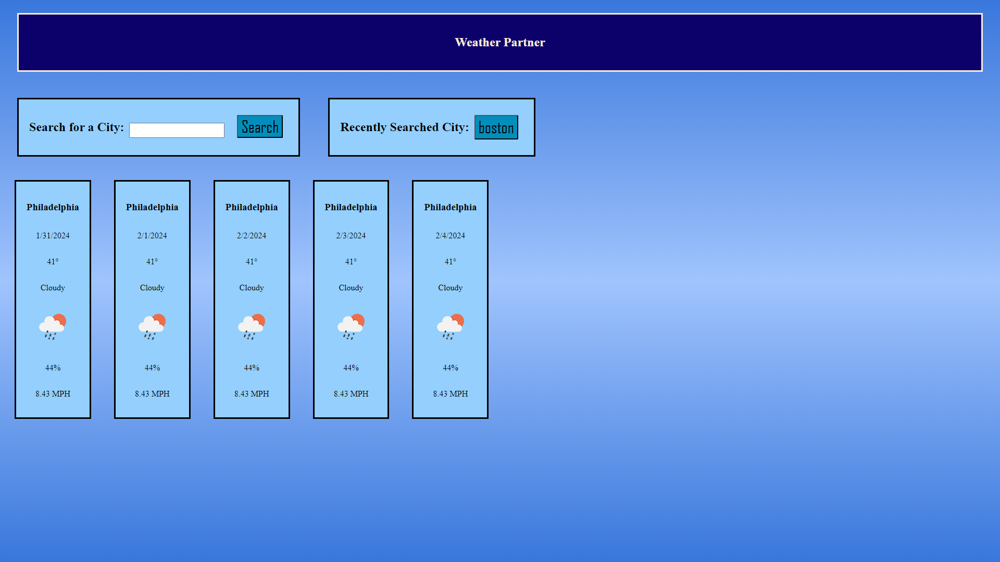

# Weather-Partner
An assistant application for forecast knowledge.

## Description
It is important that we are aware of weather conditions as we step outside our homes and advance within our day. That is where the weather partner application comes into play. This easy to use and stylish weather application will make searching for 5 day forecast an easy task. Dont get caught in the rain without an umbrella! 

### Usage
Users can type in a city name into the search input, then press the search button to display the 5 day forecast for the chosen city. The city that was searched will then populate the recently searched city box. Recently searched city will remain until new 5 day city forecast is searched for. User can click on the recently searched city button to re-search for that cities 5 forecast. 

#### Preview of Application

##### Deployed Webpage
https://pwoods125.github.io/Weather-Partner/